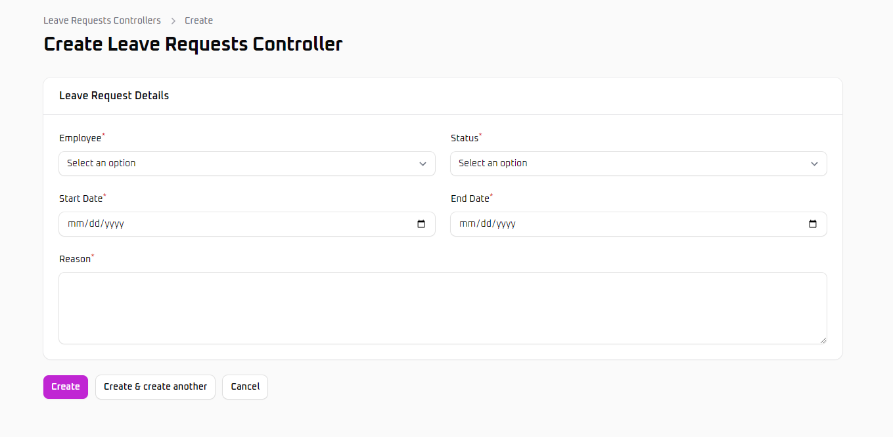
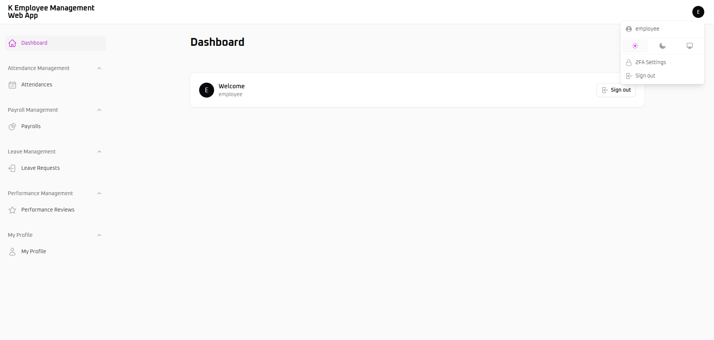

# Application Overview
This document provides an overview of the application overview. For detailed information, visit the [Wiki](https://github.com/KrisChan33/K-Employee-Management-Web-App/wiki).

---
## Home Page

---

## Login/Register
 Dark Mode: 
 Light Mode: 
 Registration Page: 

# Admin Panel

### Features

The Admin Panel is accessible to the super admin and includes:

- **Super Admin Navigation Groups**:
  - User Management
  - Spatie (Roles & Permissions)

- **User Roles**:
  - Super Admin (controller access)
  - User

- **Security**:
  - Two-Factor Authentication (2FA) for enhanced security
---
### Navigation Groups

#### Human Resources
- **Departments**: Manage department information.
- **Employees**: Manage employee records.
- **Positions**: Manage job positions.

#### Attendance Management
- **Attendances**: Track and manage employee attendance records.

#### Payroll Management
- **Payrolls**: Manage payroll information.

#### Leave Management
- **Leave Requests**: Manage leave requests.

#### Performance Management
- **Performance Reviews**: Conduct and manage performance reviews.

---

### User Roles and Permissions

- **Admin**:
  - Can create, read, update, and delete (CRUD) all records.
  - Has access to all controllers and can manage all resources.
  - Can Enable 2FA.

- **Employee**:
  - Can View own records in Attendance, Payroll, Performance Review and Profile Information
  - Can Create own record in Attendance, Leave Request, 
  - Can Delete own record in Profile Information
  - Can Update records in Profile Information.
  - Cannot delete records or access admin-specific controllers.
  - Can Enable 2FA.
  - Can Disable 2FA.

---

### Admin Dashboard

### Admin Nav

## Controllers (Admin Only)

### Attendance Controller (Table)
 

### Attendance Controller (Form)

### Payroll Controller (Table)

### Payroll Controller (Form)

### Leave Request Controller (Table)

### Leave Request Controller (Form)

### Performance Review Controller (Table)

### Performance Review Controller (Form)

---

# User Panel

### Features

The User Panel is accessible to the  panel user and includes:

- **Security**:
  - Two-Factor Authentication (2FA) for enhanced security
---
### Navigation Groups

#### Attendance Management
- **Attendances**: Track own attendance records.

#### Payroll Management
- **Payrolls**: View list of owned payroll information.

#### Leave Management
- **Leave Requests**: Track and Manage leave requests.

#### Performance Management
- **Performance Reviews**:  View owned performance reviews.

---

### User Roles and Permissions

- **Employee**:
  - Can View own records in Attendance, Payroll, Performance Review and Profile Information
  - Can Create own record in Attendance, Leave Request, 
  - Can Delete own record in Profile Information
  - Can Update records in Profile Information.
  - Cannot delete records or access admin-specific controllers.
  - Can Enable 2FA.
  - Can Disable 2FA.

---

### Employee Dashboard

### Employee Nav

## Navigations Groups

### Attendance (Table)

### Attendance (Form)

### Payroll (Table)

### Leave Request (Table)

### Leave Request Controller (Form)

### Performance Review Controller (Table)

---

### Edit Profile
Users and Admin have similar profile-editing options as including photo management.

---

### 2FA Authentication

---

## Default Permissions for 'super_admin'

- Select all

## Default Permissions Needed to set for 'panel_user'
  Only check the list below for default employee permission.

---
## Default Credentials
For an overview of the Default Credential and its navigation options, visit the Default [Default Credentials Wiki](https://github.com/KrisChan33/K-Task-Management-Web-App/wiki/6.-Default-Credentials).

## Database and Zip File
Refer to the [Database Wiki ](https://github.com/KrisChan33/K-Task-Management-Web-App/wiki/7.-Database) for instructions on importing the database and extracting resources.

## Requirements

Ensure your system meets the following requirements before starting. For more details, see the [ Requirements Wiki](https://github.com/KrisChan33/K-Task-Management-Web-App/wiki/8.-Requirements).

## Instructions
Complete installation and setup instructions are available in the [Setup Requirements Wiki.](https://github.com/KrisChan33/K-Task-Management-Web-App/wiki/7.-Instructions)

## Troubleshooting
- If you encounter missing `.env` or permissions errors, double-check file paths and server requirements.
- If `php artisan` commands fail, ensure PHP and Composer are installed and properly configured.

## License
 This project is licensed under the Apache 2.0 License - see the [LICENSE](LICENSE) file for details.
 
---
End of document.
